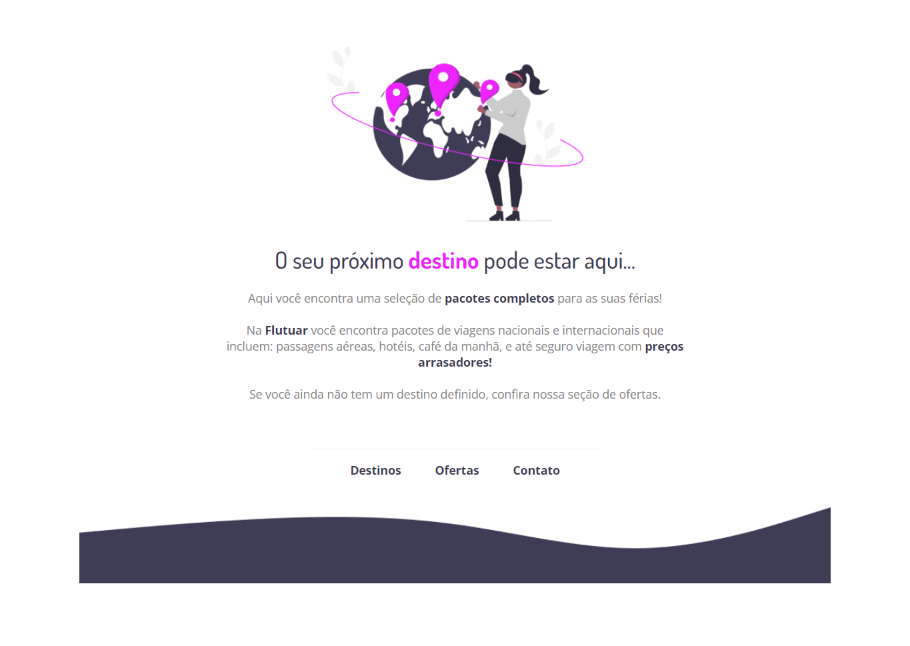

# Explorer Stage 02 - Desafio 01

>Projeto desenvolvido no Stage 02 do programa Explorer da Rocketseat turma 08 🚀

## 💻 Sobre o desafio

>Recriar uma aplicação, a partir de um layout pronto no figma, para fortalecer alguns conceitos aprendidos nas aulas 🎨

## ⚙ Tecnologias
- HTML
- CSS

[🔗 Clique aqui para acessar](https://brunakarina.github.io./challenge-01/)

## 📫 Contato
- brubskarina@gmail.com